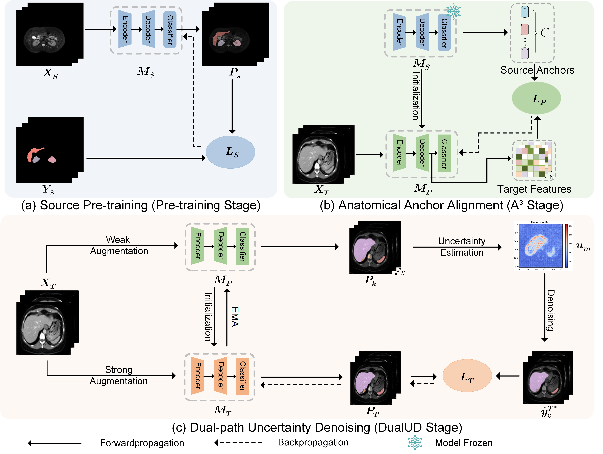

# A3-DualUD
This repository contains the source code for our paper: [Source-Free Unsupervised Domain Adaptation via Anatomical Anchor Alignment and Dual-path Uncertainty Denoising for Cross-modality Medical Image Segmentation](https://www.sciencedirect.com/science/article/abs/pii/S0169260725004341)

## Overview



A3-DualUD is a novel framework designed for unsupervised domain adaptation (UDA) in medical image segmentation, specifically in a source-free setting. This means our method adapts a model pre-trained on a source modality to a target modality **without accessing the source data** during the adaptation phase. This approach is crucial for protecting data privacy in sensitive medical applications.

The framework is built upon two key contributions:

1. **Anatomical Anchor Alignment (A³):** A module to align features based on anatomical priors.
2. **Dual-path Uncertainty Denoising (DualUD):** A module to refine pseudo-labels by leveraging uncertainty estimation, mitigating error accumulation.

## Requirements

Before you begin, ensure you have a suitable environment. We recommend:

- Python 3.10
- PyTorch 2.1.2
- A CUDA-enabled GPU

## Data Preparation

Please organize your dataset according to the following structure. For example, using the Abdomen dataset with CT and MR modalities. 

```
/path/to/your/dataset/
└── Abdomen_Dataset/
    ├── CT/
    │   ├── train/
    │   │   └── ROIs/
    │   │       ├── image/         # Contains training CT images (*.png)
    │   │       └── label/         # Contains training CT labels (*.png)
    │   └── test/
    │       └── ROIs/
    │           ├── image/         # Contains testing CT images (*.png)
    │           └── label/         # Contains testing CT labels (*.png)
    └── MR/
        ├── train/
        │   └── ROIs/
        │       ├── image/         # Contains training MR images (*.png)
        │       └── label/         # Contains training MR labels (*.png)
        └── test/
            └── ROIs/
                ├── image/         # Contains testing MR images (*.png)
                └── label/         # Contains testing MR labels (*.png)
```

## Usage

The process involves three main stages: pre-training on the source domain, and then applying one of the two adaptation methods (A³ or DualUD). The processed Abdomen datasets and checkpoints can be accessed by https://drive.google.com/drive/folders/1vQSu_nqwDx6roVp9WsN1eiYjvdwXkpyf?usp=drive_link

### Step 1: Pre-training on the Source Domain

First, train a source-only model on your source domain data. This will serve as the pre-trained model for the adaptation steps.

```
python main_trainer_source.py
```

------

### Step 2 : Adaptation with A³ (Anatomical Anchor Alignment)

This step performs source-free domain adaptation using our proposed A³ module.

```
python main_trainer_sfda.py --config_file configs/train_target_adapt_A3.yaml
```

- **Note:** It is crucial to specify the trainer for this step using `target_adapt_A3_trainer`.

------

### Step 3 : Adaptation with DualUD (Dual-path Uncertainty Denoising)

This step performs source-free domain adaptation using our proposed DualUD module.

```
python main_trainer_sfda.py --config_file configs/train_target_adapt_pseudo_label_uncertain.yaml
```

- **Note:** You must specify the trainer for this step using `target_adapt_pseudo_label_trainer_uncertain`.
## ✅ TODO List

- [x] Upload the full source code to the repository
- [x] Add installation instructions and environment requirements
- [x] Provide usage examples and command-line arguments
- [x] Provide links to datasets
## Citation

If you find our work useful in your research, please consider citing our paper.

```
@article{ZHOU2025109017,
title = {A3-DualUD: Source-free unsupervised domain adaptation via anatomical anchor alignment and dual-path uncertainty denoising for cross-modality medical image segmentation},
journal = {Computer Methods and Programs in Biomedicine},
volume = {271},
pages = {109017},
year = {2025},
issn = {0169-2607},
doi = {https://doi.org/10.1016/j.cmpb.2025.109017},
url = {https://www.sciencedirect.com/science/article/pii/S0169260725004341},
author = {Jie Zhou and Yulong Shi and Lin Qi and Xue Jiang and Shouliang Qi and Wei Qian},
}
```

## Acknowledgments

Many thanks to these excellent opensource projects
[ProtoContra](https://github.com/CSCYQJ/MICCAI23-ProtoContra-SFDA)
